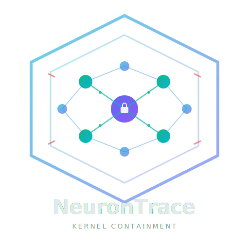

<p align="center">
  
</p>

<p align="center">
  <strong>Kernel-level behavioral containment for AI agents using eBPF/LSM.</strong>
</p>

<p align="center">
  <a href="https://github.com/yasindce1998/NeuronTrace/actions"></a>
  
  
  
</p>

---

NeuronTrace enforces **default-deny** policies on AI agent processes at the kernel level. Unlike application-layer sandboxes, agents cannot bypass enforcement — the kernel blocks syscalls before they execute.

## Key Features

- **BPF-LSM hooks**: Intercepts exec, file open, unlink, rename, connect, and ptrace at kernel level
- **Default-deny**: No policy rule = blocked. Agents start with zero permissions
- **Generation tagging**: Invalidate stale permissions when an agent starts a new task — no data leaks across generations
- **Cgroup scoping**: Enforcement targets only the agent process tree, not your entire system
- **Starter policies**: Pre-built YAML policies for Claude Code, Codex, and generic agents

## Requirements

- Linux kernel 5.15+ with BTF enabled
- BPF-LSM enabled (`CONFIG_BPF_LSM=y`, `lsm=bpf` in boot params)
- Rust nightly (for eBPF compilation)
- Root privileges (for BPF program loading)

## Quick Start

```bash
# Build everything
cargo xtask build --release

# See enforcement in action — one command, handles everything
sudo ./scripts/demo.sh
```

The demo creates a cgroup, starts NeuronTrace, runs test commands that get blocked by the kernel, shows the violation log, and cleans up. No second terminal needed.

**[Full quickstart guide →](docs/quickstart.md)**

### Manual usage

```bash
# Run with a specific policy
sudo ./target/release/neurontrace run \
  --policy policies/claude-code.yaml \
  --cgroup /sys/fs/cgroup/neurontrace

# Validate a policy without loading BPF
cargo run --package neurontrace -- validate --policy policies/generic-agent.yaml

# Bump generation (invalidate stale labels)
sudo ./target/release/neurontrace bump
```

## Project Structure

```
neurontrace/          Userspace binary — CLI, BPF loader, policy engine
neurontrace-ebpf/    BPF programs — LSM hooks (no_std, runs in kernel)
neurontrace-common/  Shared types between kernel and userspace
xtask/               Build automation
policies/            Starter policy packs (YAML)
```

## How It Works

1. **Load**: The userspace binary loads BPF programs into the kernel via aya
2. **Attach**: LSM hooks fire on every relevant syscall within the target cgroup
3. **Check**: Each hook looks up the policy map — no match means block
4. **Report**: Violations emit events via ring buffer back to userspace
5. **Feedback**: Userspace logs violations and (in future) feeds them back to the agent

## Writing Policies

Policies are YAML files with a list of rules. Each rule maps an event type to an action:

```yaml
name: my-policy
description: Custom policy for my agent
rules:
  - event_type: exec
    action: block
  - event_type: open
    action: allow
  - event_type: connect
    action: audit
```

Actions: `allow`, `block`, `kill`, `audit`

Event types: `exec`, `open`, `unlink`, `rename`, `connect`, `ptrace`

## Documentation

| Doc | Description |
|-----|-------------|
| **[Quick Start](docs/quickstart.md)** | See enforcement in one command |
| [Policy Reference](docs/policies.md) | Schema, event types, actions, examples |
| [Use Cases](docs/usecases.md) | 8 real-world scenarios with ready-to-use policies |
| [Development Guide](docs/development.md) | Kernel setup, building, VM testing, debugging |
| [Contributing](CONTRIBUTING.md) | How to contribute, code style, CI |
| [Security Policy](SECURITY.md) | Reporting vulnerabilities |
| [Changelog](CHANGELOG.md) | What's changed |

## License

MIT
